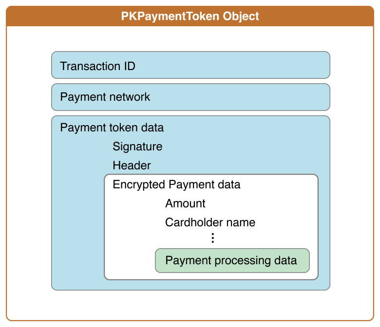

Apple Pay Token handling in Node.js Applications
===================================

We will try to describe the approach we followed to handle generated apple pay tokens.

Apple reference:

[https://developer.apple.com/library/ios/documentation/PassKit/Reference/PaymentTokenJSON/PaymentTokenJSON.html](https://developer.apple.com/library/ios/documentation/PassKit/Reference/PaymentTokenJSON/PaymentTokenJSON.html)

Introduction
------------


- ````PKPaymentToken````:
	- ````paymentData````: Contains a UTF–8 serialization of a plain-text JSON dictionary.
		- ````data````: Encrypted payment data (payment data dictionary, Base64 encoded as a string).
			- ````applicationPrimaryAccountNumber````: Device-specific account number of the card that funds this transaction (string).
			- ````applicationExpirationDate````: Card expiration date in the format ````YYMMDD```` (date as a string).
			- ````currencyCode````: ISO 4217 numeric currency code, as a string to preserve leading zeros (string).
			- ````transactionAmount````: Transaction amount (number).
			- ````cardholderName````: *Optional* Cardholder name (string).
			- ````deviceManufacturerIdentifier````: Hex-encoded device manufacturer identifier (string).
			- ````paymentDataType````: Either "3DSecure" or "EMV" (string).
			- ````paymentData```` (**3-D Secure**): detailed payment data (payment data dictionary).
				- ````onlinePaymentCryptogram````: Online payment cryptogram, as defined by 3-D Secure (string).
				- ````eciIndicator````: *Optional* ECI idicator, as defined by 3-D Secure (string).
			- ````paymentData```` (**EMV**): detailed payment data (payment data dictionary). We are only going to use "EMV".
				- ````emvData````: Output from the Secure Element (EMV payment structure, Base64 encoded as a string).
		- ````header````: Additional version-dependent information used to decrypt and verify the payment (header dictionary).
			- ````applicationData````: *Optional* Hash of the applicationData property of the original ````PKPaymentRequest```` object. If the value of that property is ````nil````, this key is omitted (SHA–256 hash, hex encoded as a string).
			- ````ephemeralPublicKey````: Ephemeral public key bytes (X.509 encoded key bytes, Base64 encoded as a string).
			- ````publicKeyHash````: Hash of the X.509 encoded public key bytes of the merchant’s certificate (SHA–256 hash, Base64 encoded as a string).
			- ````transactionId````: Transaction identifier, generated on the device (hexadecimal identifier, as a string).
		- ````signature````: Signature of the payment and header data (detached PKCS \#7 signature, Base64 encoded as string).
		- ````version````: Version information about the payment token (string).

## Steps to decrypt payment data:
1. Verify the signature as follows:
	1.	Ensure that the certificates contain the correct custom OIDs: 	
		- ````1.2.840.113635.100.6.29```` for the leaf certificate
		- ````1.2.840.113635.100.6.2.14```` for the intermediate CA

	The value for these marker OIDs doesn’t matter, only their presence.

	2. Ensure that the root CA is the Apple Root CA - G3. This certificate is available from http://apple.com/certificateauthority.

	3. Ensure that there is a valid X.509 chain of trust from the signature to the root CA. Specifically, ensure that the signature was created using the private key corresponding to the leaf certificate, that the leaf certificate is signed by the intermediate CA, and that the intermediate CA is signed by the Apple Root CA - G3.

	4. Ensure that the signature is a valid ECDSA signature (ecdsa-with-SHA256 1.2.840.10045.4.3.2) of the concatenated values of the ephemeralPublicKey, data,transactionId, and applicationData keys.

	5.	Inspect the CMS signing time of the signature, as defined by section 11.3 of RFC 5652. If the time signature and the transaction time differ by more than a few minutes, it's possible that the token is a replay attack.

2.	Use the value of the ````publicKeyHash```` key to determine which merchant public key was used by Apple, and then retrieve the corresponding merchant public key certificate and private key.

3.	Using the merchant private key and the ephemeral public key, generate the shared secret using Elliptic Curve Diffie-Hellman (id-ecDH 1.3.132.1.12).

4.	Using the merchant identifier field (OID 1.2.840.113635.100.6.32) of the public key certificate and the shared secret, derive the symmetric key using the key derivation function described in NIST SP 800-56A, section 5.8.1, with the following input values:

|Input Name|Value|
|-|-|
|Hash function|SHA-256|
|Z|The shared secret calculated above using ECDH.|
|Algorithm ID|The byte (````0x0D````) followed by the ASCII string “````id-aes256-GCM````”. The first byte of this value is an unsigned integer that indicates the string’s length in bytes; the remaining bytes are a variable-length string.|
|Party U Info|The ASCII string “````Apple````”. This value is a fixed length string.|
|Party V Info|The SHA-256 hash of the merchant identifier. This value is a fixed length bit string.|
|Supplemental Public and Private Info|Unused.|

Note: The SHA-256 hash function produces exactly the needed amount of key material, so there is only one iteration of the key-derivation function’s loop.

5.	Use the symmetric key to decrypt the value of the data key using AES–256 (id-aes256-GCM 2.16.840.1.101.3.4.1.46), with an initialization vector of sixteen null bytes and no associated authentication data. If the signature is invalid or any of the hashes don’t match, ignore the transaction.

## Steps to decrypt payment data:
 
Summarizing, we need to generate a shared secret key using the ephemeral public key. Then we need to use this new shared secret to generate the symmetric key. Finally, the symmetric key will be using to decrypt the payment token.

	//Generating shared Secret
    let sharedSecret = generateSharedSecret(merchantPrivateKey, ephemeralPublicKey);

    //Generating simetric Key'
    let simetricKey = generateSymmetricKey(merchantId, sharedSecret);

    // Decrypt Cipher text
    let decrypted = decryptCiphertext(simetricKey, IV, ciphertext);

### 1. Create a function to generate the shared secret. 

First step is to generate the shared secret token, to do this we will need the Merchant private Key that we received from Apple. As part of the payment token data, we will receive the ephemeral Public Key that we also need to generate the shared secret.

As the Apple Pay certificate is issued using `prime256v1` encryption, we will need to create an elliptic curve object using this curve name. 

#### crypto.createECDH(curvename)


Creates an Elliptic Curve Diffie-Hellman (ECDH) key exchange object using a predefined curve specified by the curvename string. 
Use crypto.getCurves() to obtain a list of available curve names. On recent OpenSSL releases, openssl ecparam -list_curves will also display the name and description of each available elliptic curve.

After creating the Elliptic Curve object we can assign the merchant private key to it. At this point we will be able to compute any secrets using the private key, in this case we will generate one for the received ephemeral public key

	function generateSharedSecret (merchantPrivateKey, ephemeralPublicKey) {
		let
	      om,
	      ecdh = crypto.createECDH('prime256v1');
		    ecdh.setPrivateKey(((new Buffer(merchantPrivateKey, 'base64')).toString('hex')).substring(14, 64 + 14),'hex'); // 14: Key start, 64: Key length
		      try{
		        om = ecdh.computeSecret(((new Buffer(ephemeralPublicKey, 'base64')).toString('hex')).substring(52, 130 + 52),'hex','hex'); // 52: Key start, 130: Key length
		      }catch(e){
		        return e;
		      }
		
			return om;
		}

### 2. Create a symmetric key

As described in the reference, the symmetric key is a `sha256` hash that contains shared secret token plus encoding information.

	function generateSymmetricKey (merchantId, sharedSecret) {
		const
			  KDF_ALGORITHM = String.fromCharCode(0x0D) + 'id-aes256-GCM',
		      KDF_PARTY_V = (new Buffer(merchantId, 'hex')).toString('binary'),
		      KDF_INFO = KDF_ALGORITHM + 'Apple' + KDF_PARTY_V
	        ;
		let
			hash = crypto.createHash('sha256');
	    	hash.update(new Buffer('000000', 'hex'));
	    	hash.update(new Buffer('01', 'hex'));
	    	hash.update(new Buffer(sharedSecret, 'hex'));
	    	hash.update(KDF_INFO);
	
		return hash.digest('hex');
	}

### 3. Decipher payment data

We should have at this point available the cipher text from the token (`data` in the original payment token). Using the generated symmetric we will create a decipher object and will update it with the cipher text. The decipher will return a new buffer with the result, in this example we have decided to use `hex` format to finally output the payment data. 

####crypto.createDecipher(algorithm, password)


Creates and returns a Decipher object that uses the given algorithm and password (key).

The implementation of crypto.createDecipher() derives keys using the OpenSSL function EVP_BytesToKey with the digest algorithm set to MD5, one iteration, and no salt. The lack of salt allows dictionary attacks as the same password always creates the same key. The low iteration count and non-cryptographically secure hash algorithm allow passwords to be tested very rapidly.


	function decryptCiphertext (symmetricKey, iv, ciphertext) {
		const
	        SYMMETRIC_KEY = forge.util.createBuffer((new Buffer(symmetricKey, 'hex')).toString('binary')),
		      IV = forge.util.createBuffer((new Buffer([0,0,0,0,0,0,0,0,0,0,0,0,0,0,0,0])).toString('binary')),
		      CIPHERTEXT =  forge.util.createBuffer(forge.util.decode64(ciphertext))
	        ;
	
		let decipher = forge.cipher.createDecipher('AES-GCM', SYMMETRIC_KEY);
	    	decipher.start({
	    	  iv: IV,
	    	  tagLength: 0,
	    	  tag: forge.util.decode64("")
	    	});
	    	decipher.update(CIPHERTEXT);
	    	decipher.finish();
		return (new Buffer (decipher.output.toHex(), 'hex').toString('utf-8'));
	}

## Example payment data

	{
	"version":"EC_v1",
	"signature":"ZmFrZSBzaWduYXR1cmU=",
	"header":	{
		"ephemeralPublicKey":"MFkwEwYHKoZIzj0CAQYIKoZIzj0DAQcDQgAEzLx7FJhw1Z1PmxOLMTQBs1LgKEUT6	hcxLlT8wGrzwyY8tKeG+VPSjryVkTFYECrj+5r28PJWtmvn/unYhbYDaQ==",
		"publicKeyHash":"OrWgjRGkqEWjdkRdUrXfiLGD0he/zpEu512FJWrGYFo=",
		"transactionId":"1234567890ABCDEF"
		},
	"data":"IaD7LKDbJsOrGTlNGkKUC95Y+4an2YuN0swstaCaoovlj8dbgf16FmO5j4AX80L0xsRQYKLUpgUHbGoYF26PbraIdZUDtPtja4HdqDOXGESQGsAKCcRIyujAJpFv95+5xkNldDKK2WTe28lHUDTA9bykIgrvasYaN9VWnS92i2CZPpsI7yu13Kk3PrUceuA3Fb6wFgJ0l7HXL1RGhrA7V5JKReo/EwikMsK8AfChK7pvWaB51SsMvbMJF28JnincfVX39vYHdzEwpjSPngNiszGqZGeLdqNE3ngkoEK1AW2ymbYkIoy9KFdXayekELR6hQWnL4MCutLesLjKhyTN26fxBamPHzAf/IczAdWBDq2P/59jheIGrnK30slJJcr1Bocb8rqojyaVZIY+Xk24Nc6dvSdJhfDDyhX56pn5YtWOxWuVOT0tZSJvxBN/HeIuYcNG6R9u7CHpcelsi4I8O+1gruKKZQHweERG2DyCmoUO9zlajOSm"
}

            